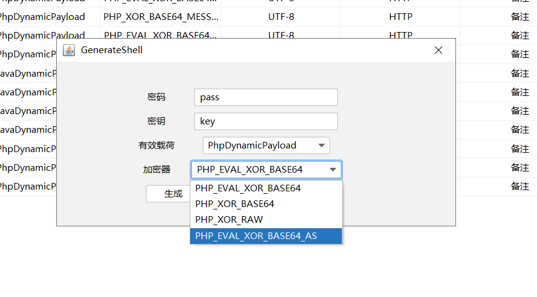
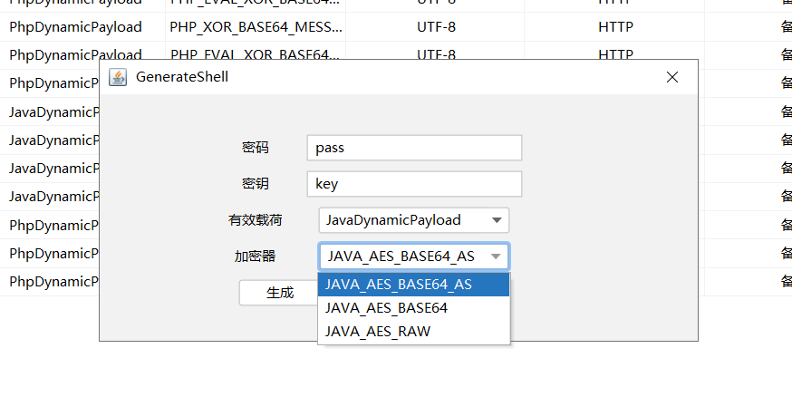
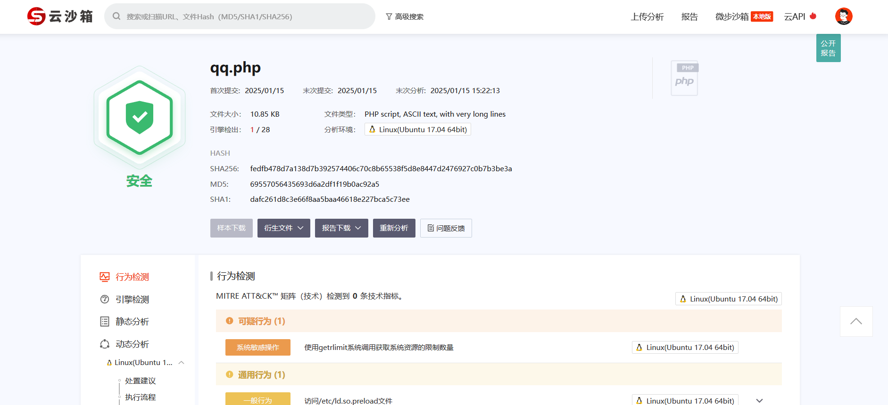
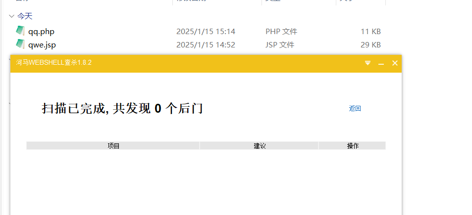
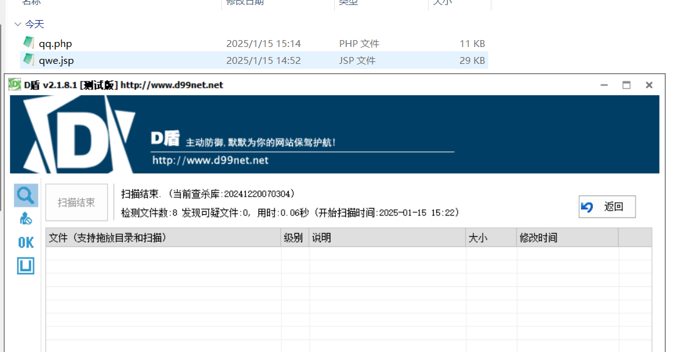
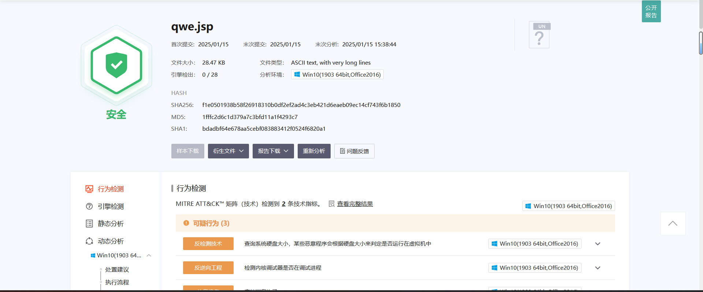

# K_Godzilla  （The King Godzilla）

​																									

## Introduction

I am analyzing and researching the webshell tool - [[Godzilla 4.0.1](https://github.com/BeichenDream/Godzilla)] source code, modified the traffic characteristics, and made some processing to bypass AV detection. This tool is only for personal learning, if there is any offense, please contact to delete it.

Thanks to the open source spirit of [[the original author](https://github.com/BeichenDream/Godzilla)] .

The anti-killing reference: [[XG_NTAI](https://github.com/xiaogang000/XG_NTAI)] .


## Using

Repository:https://github.com/AgonySec/K_Godzilla

**Use Java11 or Java8 to start the jar package**

**It is currently only modified PHP and JSP Trojan.**

PHP Trojan Instructions: (The file parameter is the server in the response header)

```
parameters: /xxxx.php?file=QzpccGhwU3R1ZHlcUEhQVHV0b3JpYWxcV1dXXDEyMy5waHA=
```



JSP Trojan is temporarily suitable for Tomcat8




## Bypass

There is a detection (shellpub), but it is still identified as security:







## **Disclaimer**

- This tool can only be used in the enterprise security construction with sufficient legal authorization. During the use of this tool, you should ensure that all your actions comply with local laws and regulations.
- If you engage in any illegal activities during the use of this tool, you will bear all the consequences yourself. All developers and contributors of this tool will not bear any legal and joint liability.
- Please do not install and use this tool unless you have fully read, fully understood and accepted all the terms of this agreement.
- Your act of using or your express or implied acceptance of this agreement in any other way shall be deemed as your reading and consent to the binding of this agreement.